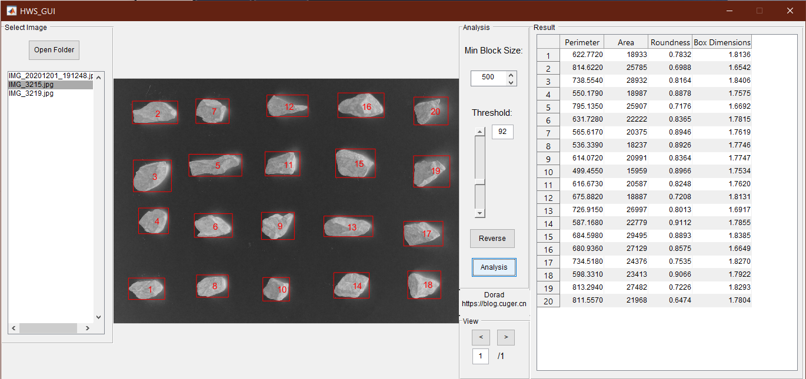

A box count and roundness analysis tool based on MATLAB.

# Install

- Download the latest release from [Last Release](https://github.com/Doradx/BoxCount-RoundnessForSamples/releases/latest).
- Change the location in `Matlab`
- Run `HWS_GUI.m` to start the program.

# Screenshot

# Author

Dorad, cug.xia@gmail.com